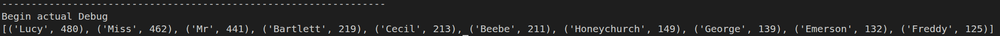
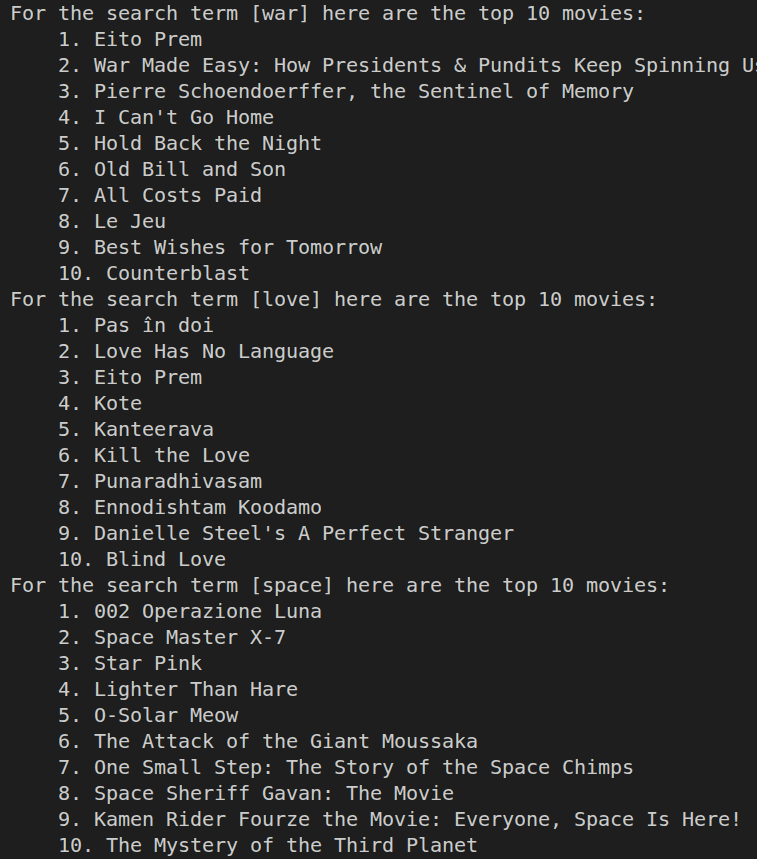
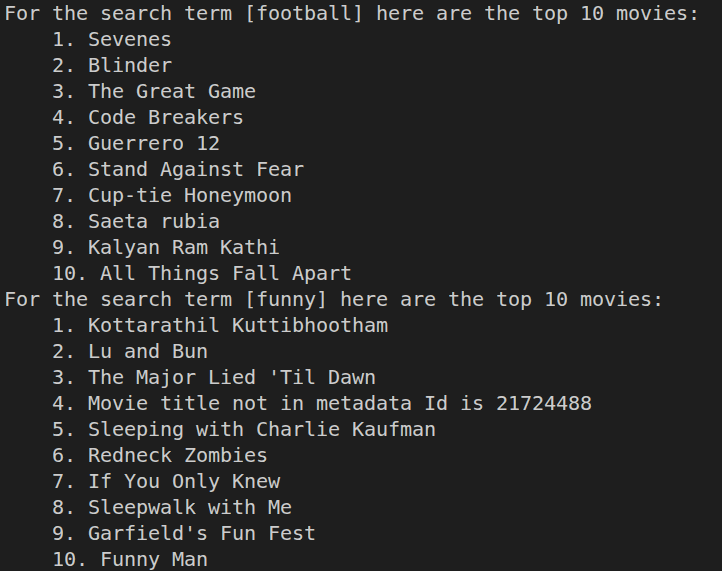
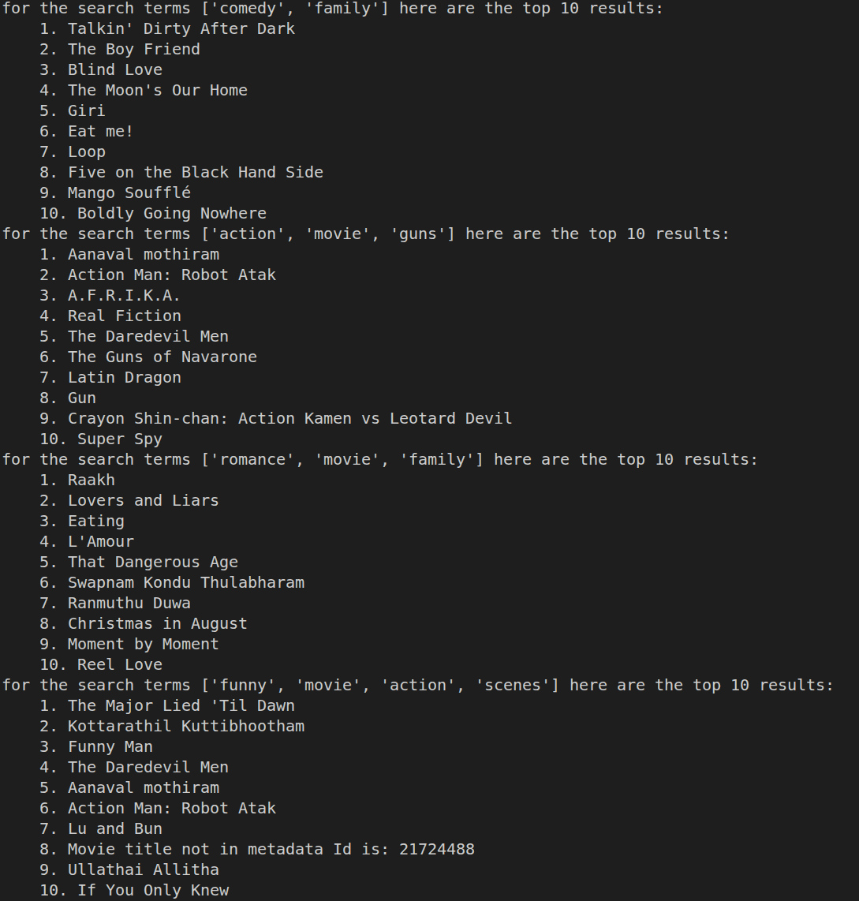
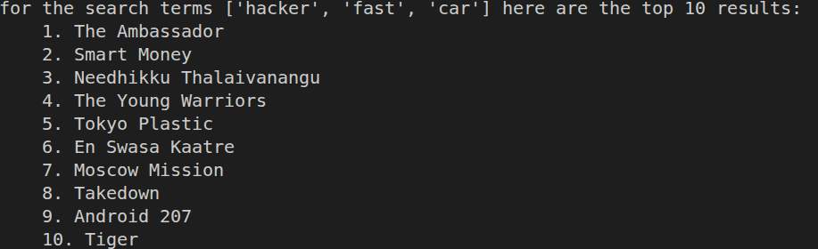

Brendan Martel
Bxm240013

Information for running these files:
If you want to run these files you will need a virtual enviorment with the following installed:
- pyspark
- nltk
- numpy

from there you will need to use spark-submit followed by the name of the file that you want to run

# information for part one: 
There are two methods of running this file. If you want to use the preprocessed midopointMulti.csv you can run it with the processing flag turned to false
If you want to do full processing of a remote file change the file URl and then change the processing flag to true. This will process a new file and produce
a new midpointMulti.csv with the relevant information. this file works in the following way: 

1. The file is downloaded form the website using wget
2. The file is then processed using a mulitprocessed method of processing
3. The processing is then writen out to a midpointMulti.csv in case of crash or something as it takes a while
4. proceeds to map reduce for wordcount and ouputs descending wordcount to the console

## screenshots

# information for part two:

This file assumes the you have three files in the cwd: searchTerms.txt, plot_summaries.txt, and movies.metadata.tsv. plot summaries and movies are pulled from offline and need to be extracted in toe the cwd. if you are downloading the assignment they should already be in there. as for searTerms.txt each line is read as a new search query. It can be a sentence but the program will remove stopwords. The program works in the followitg way: 

1. summaries are read into the SC
2. all parts needed for tf idf are calculated like normalized tf and idf for each term and document
3. The metadata file is processed and turned into a dictionary for quick lookup
4. we process each line from the search file and perform actions based on the length of the query.
5. output the rankings for each movie title

- for short queries we simply return the documents with the largest tf-idf for that term
- for longer queries its a bit more complicated. We first start by calculating the tfIdf for each of the search terms. we then need to calculate the cosine similarity which is the folowing formula:
- d * q/ ||d||X||q|| 
- we dont use any libraries we just perform it manualy for all of the documents at once. we first have to calculate the dot product of each document with the query vector. We do this by creating a rdd with the query tfidfs and then joinging it on the similar terms for each document that contains them. we can then perform the dot product for all of them at once. we can then sum all the occourances of those terms together for each movie. We then compute the magnitude of the document vector for each document with the following formula:
- sqrt(sum(tfidf^2)) 
- from there we can also calculate the magnitude of the search vector. From this point we just plug and chug and then rank order all of the results for output. 

## screenshots: 
### Five single term searches:

### Five multi term searches:

